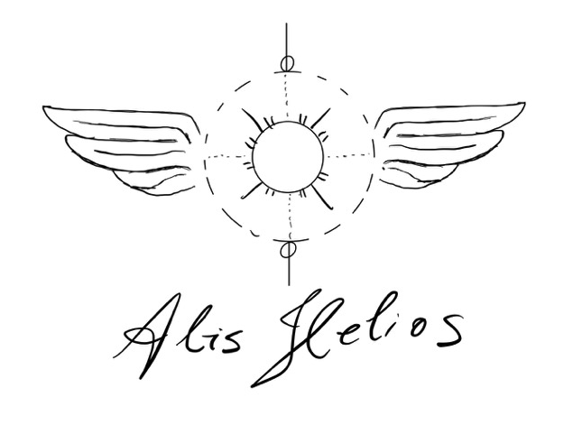

# Alis Helios


<p align="center">
  
</p>


Alis Helios is an ongoing project that provides tools and a graphical user interface (GUI) to analyze astrophysical and space physics data, supporting various
computational functionalities such as orbit calculations, power spectral density analysis, and data visualization. More details about the code can be found on a poster
I presented at the 15th International Symposium for Space Simulations (ISSS-15) and the 16th International Workshop on the Interrelationship between Plasma 
Experiments in the Laboratory and in Space (IPELS-16). [Link to the poster.](http://www.nathan.science/talks/15th-international-symposium-for-space-simulations-isss-15-and-the-16th-international-workshop-on-the-interrelationship-between-plasma-experiments-in-the-laboratory-and-in-space-ipels-16)

The code has been designed to accommodate any data that can be accessed with a few python lines of code. As of now we use THEMIS and MMS data, but in principle with a few lines of code 
you can add any other spacecraft/satellite/etc. Once the data is downloaded the tools used for time series analysis could be translated to the time series data of the new source. 

## Features (in development)

- **GUI Support**: Developed in PyQt6 for interactive data manipulation.
- **Orbit Calculation**: Provides modules for orbit tracking and analysis.
- **Power Spectral Density Analysis**: Computes and visualizes power spectral densities.
- **Kinetics Module**: Includes tools for analyzing kinetics-related data in space plasma physics contexts.

## Requirements

Ensure you have the following dependencies installed:

```plaintext
pytplot==1.7.28
PyQt6==6.7.0
pyspedas==1.5.12
numpy==1.26.4
matplotlib==3.9.0
plotly==5.22.0
spacepy==0.6.0
pandas==2.2.2
scipy==1.13.1
```

You can install these dependencies by running:

```bash
pip install -r requirements.txt
```

## Installation

1. Clone this repository:
   ```bash
   git clone https://github.com/nathanfelipe/alis_helios.git
   cd alis_helios
   ```

2. Install the required dependencies:
   ```bash
   pip install -r requirements.txt
   ```

3. Run the main application:
   ```bash
   python main.py
   ```
4. Another option is to open the local repository as a project on your favourite IDE.    

## Usage

All options can be used via de GUI by just runnig main.py. More details about the individual files: 

- **Graphical Interface**: `gui.py` is responsible for the GUI, used in interactive data analysis.
- **Orbit Calculations**: Use `orbit.py` for orbit-related data manipulation. There is a 2D and a 3D possibilities, but debugging is still needed on the 2D version.
- **Spectral Analysis**: Execute `power_spectral_density.py` for spectral analysis.
- **Kinetics Data Processing**: Use `kinetics.py` to analyze kinetics data.

## Files Overview

- **main.py**: Entry point of the application, prompting users with questions for different types of analysis.
- **gui.py**: Contains the GUI setup and interaction logic.
- **orbit.py**: Module for orbit calculations.
- **power_spectral_density.py**: Module for spectral analysis.
- **kinetics.py**: Module for kinetics-related data processing.
- **downloader.py**: Supports data downloading and pre-processing.

## References

I learned a lot of the content used to develop  this code from online classes and documentations from the main libraries (pyspedas, sunpy, plasmapy, etc). But for an
incredible helpful source/reference, I would like to mention the [Python Heliophysics Community](https://heliopython.org), and all the resources therewithin. 

## Future Enhancements

Refer to `todo.txt` for planned improvements and ongoing tasks. I would be happy to have collaborators for this project, please contact me if you are interested. 
One of my main goals is to install a Machine Learning module in order to use the various time series from different spacecrafts as input for training those models. 
For Time Series Analysis using Algebraic Topology I would refer you to my "Topological Data Analysis" project. 

## License

This project is licensed under the MIT License.
